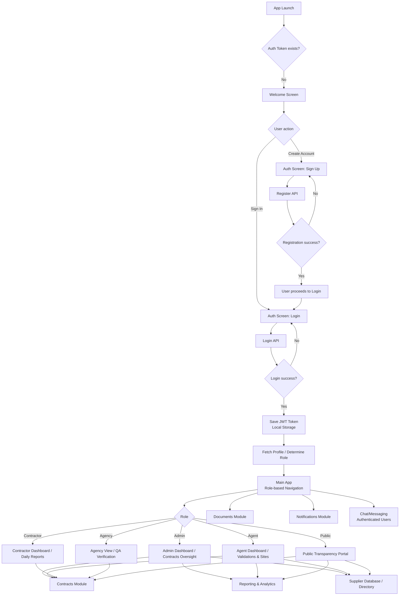
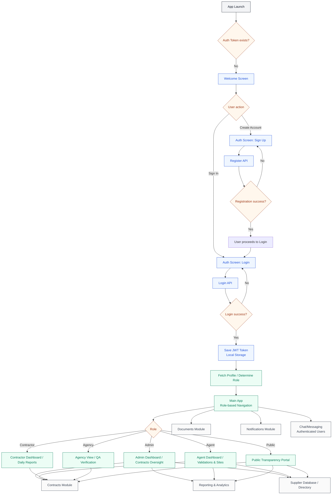

# AGIR App Flow Diagram (PDF-ready)

## How to export to PDF

- Use a Markdown-to-PDF tool that supports **Mermaid**.
- Keep page size **A4** and enable **scale to fit width** if available.

---

## High-Level AGIR Flow (End-to-End)

---

## High-Level AGIR Flow (Styled Version)

